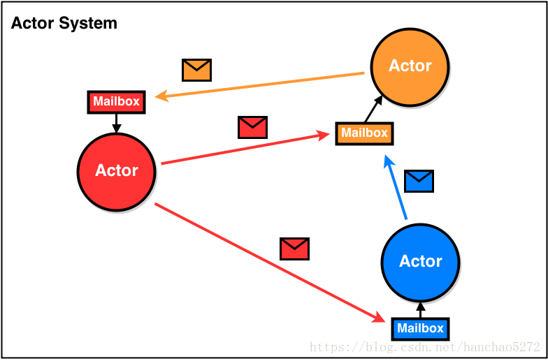

#  actor模型 
Java中的Akka Actors简介
--
演员模型对计算机科学界来说并不陌生。它最初由Carl Eddie Hewitt于1973年引入，作为处理并发计算的理论模型。

当软件行业开始意识到实现并发和分布式应用程序的缺陷时，它开始显示其实际适用性。

actor代表一个独立的计算单元。一些重要的特征是：

一个actor封装了它的状态和部分应用程序逻辑
actor只通过异步消息进行交互，而不是通过直接方法调用
每个actor都有一个唯一的地址和一个邮箱，其他actor可以在其中传递消息
actor将按顺序处理邮箱中的所有邮件（邮箱的默认实现是FIFO队列）
actor系统以树状层次结构组织
一个actor可以创建其他actor，可以向任何其他actor发送消息并停止自己或者已创建任何actor
------
#  Actor理论

Actors并发模型是计算机科学领域中的一个并行计算模型，它把actors当做通用的并行计算原语。 
一个actor对接收到的消息做出响应，进行本地决策，可以创建更多的actor，或者发送更多的消息；同时准备接收下一条消息。 
在Actor理论中，一切都被认为是actor，这和面向对象语言里一切都被看成对象很类似。 
但包括面向对象语言在内的软件通常是顺序执行的，而Actor模型本质上则是并发的。
模型图如下：

#  Akka Actors重要概念
1.Actor

Actor即角色，前面已经说过，Akka Actors模型将actors当做通用的并行计算原语，所以Actor是必不可少的。

Actor总结：

Akka Actor的组织结构是一种树形结。
因为Actor是树形组织，所以Actor的路径类似于文件的路径。
每个Actor都有父级，有可能有子级当然也可能没有。
父级Actor给其子级Actor分配资源，任务，并管理其的生命状态（监管和监控）。
如果我们知道一个远程Actor的具体位置，那么我们就可以向他发送消息。
一个本地Actor的路径：akka://search-system/user/master
一个远程Actor的路径：akka.tcp://search-system@host.example.com:5678/user/master

