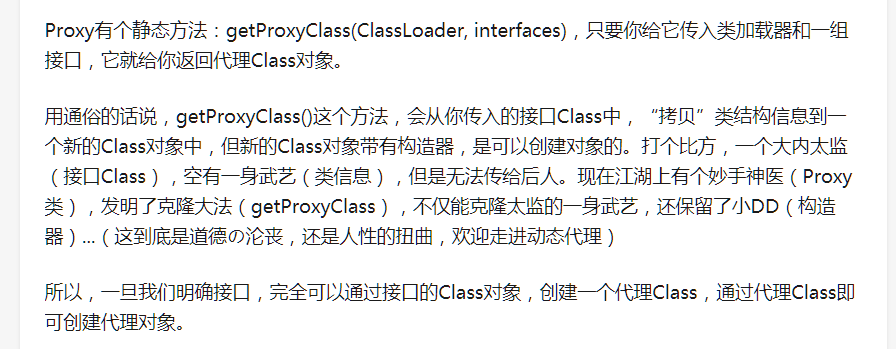
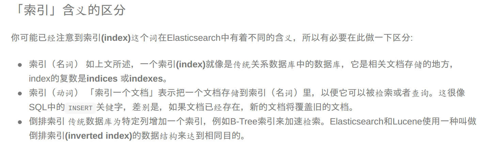

关于使用学习es数据库 笔记
--
以下是基于 es 6.2.4 版本的数据库进行操作实践

#  关于es 和 普通 关系型数据库对比

#  关于es 中索引的概念

#  es中全文搜索
##  es 中的相关性概念 
es数据库和其他数据库的一个区别就是 ，其他数据库只有匹配和不匹配 概念 ，而es数据库引入了相关性 ，即会检索出和给定条件相关的 并且以相关程度 排序返回结果
##  es中短语搜索
支持多个单词搜索 ，比如我们需要查出拥有 my name两个单词的数据
##  es 聚合
es 也拥有 关系型数据库一样的group by分组统计的语法 称之为 聚合
##  
