# 很有必要先了解
## pg 权限
http://www.freeoa.net/osuport/db/the-postgres-privileges_3112.html
## 关于表空间
- 表空间pg_default是用来存储系统目录对象、用户表、用户表index、和临时表、临时表index、内部临时表的默认空间。对应存储目录$PADATA/base/
- 表空间pg_global用来存放系统字典表；对应存储目录$PADATA/global/
## 关于超级用户
        超级用户：类似于其他系统的sa、root、sysdba
        pg中的superuser是不受postgresq的对象权限系统控制的，一旦登录就可以做任何事情
        所以创建角色（用户）不要指定 是超级用户
        官方 ：数据库超级用户会绕过除登录权限以外的所有权限检查。这是一种危险的特权，不应粗心使用；否则，将不予使用。最好以不是超级用户的角色来完成大部分工作。要创建新的数据库超级用户，请使用CREATE ROLE 名称 SUPERUSER。您必须以已经是超级用户的角色来执行此操作
## 关于模式
        postgresql中的schema,postgresql中的schema和其它关系型数据库中的
        schema含义是一致的,在oracle中叫schema或者用户,只是oracle中schema和用户是始终一一对应.
        postgresql中user和schema是可以不一致的,相对比其它数据库复杂一点.
        在创建schema的时候,可以指定schema的所属用户,默认的只有所属用户（角色）
        和超级用户才能在此schema进行对象操作,否则就需要授权.
## 关于角色 
        postgresql自8.1后不再区分用户、组了。称之为角色role
        role是和数据库无关的
        role就是权限的集合
        role可以互相交叉、继承、被赋于对象权限(有问题，项目交叉 欧阳验证失败，待确认)
        关于阅读官方文档第20章 
        一个角色是一个可以有自己的数据库对象和数据库操纵权限的实体,一个角色可以被认为是一个“用户”,一个“组”,或者两者都可，取决于它的使用方式。<br>
        在上一个文档提及 8.1之后不在区分用户、组了。称之为角色role <br>
        所以 从 pgadmin 上来看 角色 可以分为 两个 一个是 组角色 不能登录就是 组角色 一个是 登录角色 可以登录就是 登录角色 

## 关于对象访问权限的问题
        如果某个用户需要访问某张表,那么用户首先需要有访问该表所在schema的权限.默认只有schema(以及所有superuser都可以访问)
        的所属可以直接操作该schema,其它用户需要授权(public schma除外)
        举例 ：
        如果 我有用户u1 不是超级用户 可以登录，登录之后创建模式s1，在s1下创建表t1，
        然后使用u2 登录 不是超级用户 可以登录 ，如果 要访问 表t1 就需要先
        grant usage on schema s1 to u2;
        先保证用户拥有 模式的使用权限 （不太理解 正常解释是 对于Schema来说，允许查找该Schema下
        的对象，但是并不是如此，还需要对对象进行精确的授权）
        grant select s1.t1 to u2 
        然后将t1 表的 查询权限赋予 u2 这样u2 才能对t1表进行数据查询
# 关于确定国土在pg数据库储存
目前将数据库层片 不会对 数据进行垂直拆分
所以 我们直接创建一个用户，一个同名模式 ，还得为每一个用户进行模式授权 ，注意关联模式所属的用户 并不会自动授权 
# 各种操作
## 使用 命令行 
```sql
--dgpnr_pro
-------------------------------------创建数据-----------------------------------
如果 要使用到超级用户 使用db自带的 postgres 就可以了 没有必要 自己创建一个
-- 1、创建用户 并设置登陆密码
CREATE ROLE "dgpnr_pro" PASSWORD 'nr#2019' LOGIN;

-- 2、创建表空间 (默认表空间 pg_default)
CREATE TABLESPACE "dgpnr_pro_tbspace" OWNER "dgpnr_pro" LOCATION 'G:\postgresql\pgsql9.4.24\data\temp';

-- 3、创建数据库
CREATE DATABASE dgpnr_doc OWNER = "dgpnr_pro" ENCODING = 'UTF-8' TABLESPACE = "dgpnr_pro_tbspace";
-- 创建schema  schema一般与用户名一样(在使用表视图等时可以不用写schema，查询也会直接查与用户名相同的schema下的数据)
-- 4、请登陆上面创建的账号之后再创建模式，以免模式创建在postgres库下
CREATE SCHEMA IF NOT EXISTS "dgpnr_pro" AUTHORIZATION "dgpnr_pro";
--5、 手动进行角色授权
grant all on schema dgpnr_pro to dgpnr_pro;
```


## 使用工具 navicat 以及 pgadmin雷同 （navicat 代表）
其实工具也可以按照上面的操作步骤走 ，无非就是点点点的操作，下面截图主要告诉对应的ui在哪 
### 首先使用 superuser登录

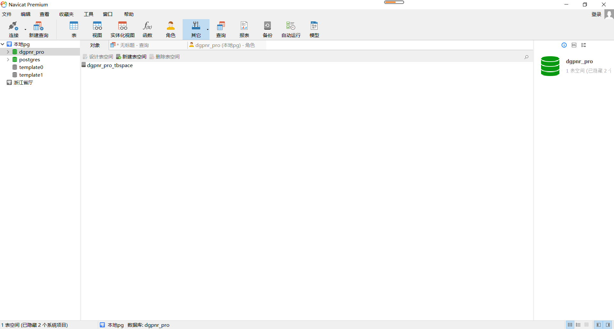
### 首先使用 创建用户
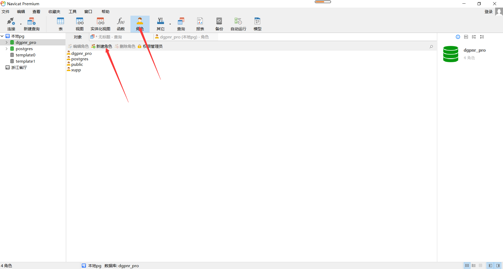
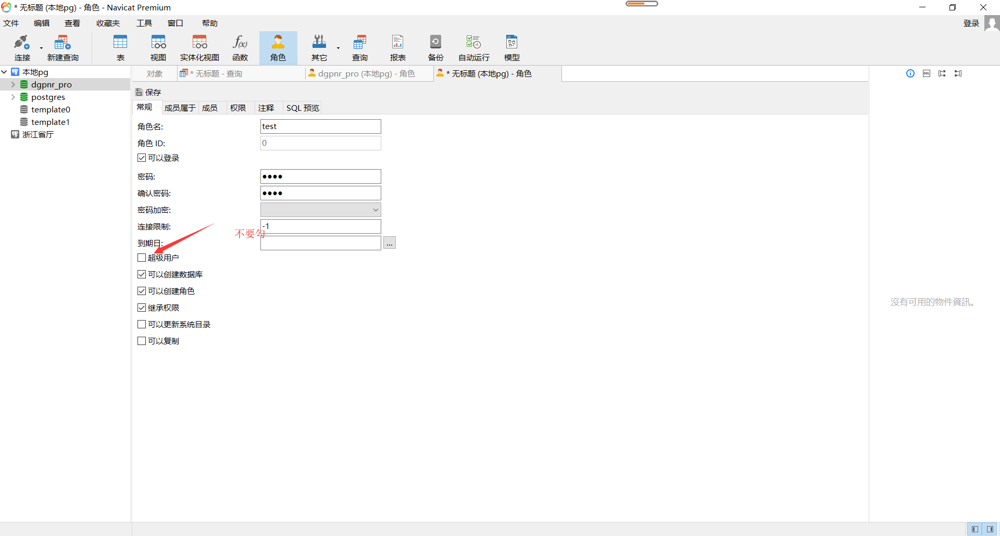
### 创建表空间
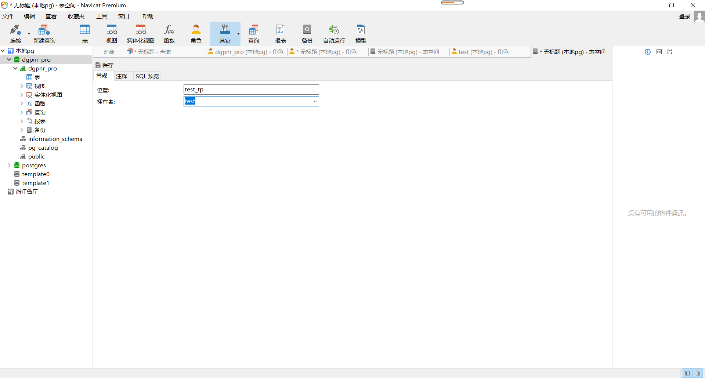
### 创建数据库
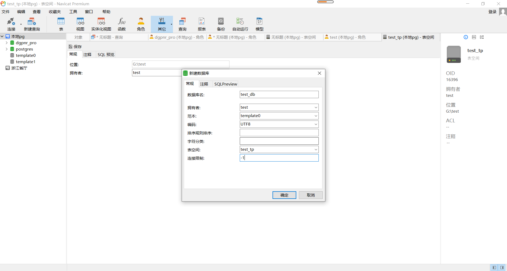
### 创建模式
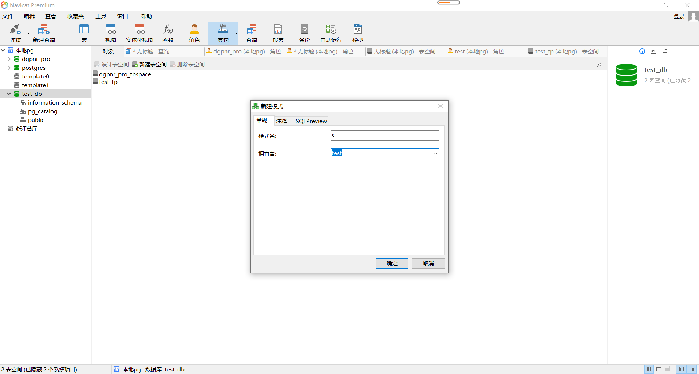
### 授权 
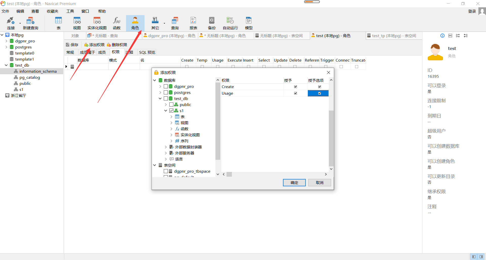


## 备份与还原

### 一、navicat[备份/还原]

1. 在选择的模式下选中备份，右击选择`新建备份`或者点击`右边的新建备份按钮`

   可以在对象选择中选择备份的东西，然后点击开始即可，完成后点击关闭，然后产生了下面这样的文件

   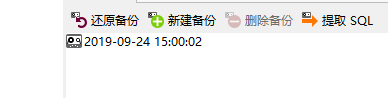

   右键点击它，可以查看文件所在的位置

   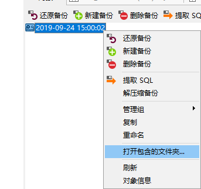

2. 数据还原

   点击上一步生成的备份文件，然后点击`还原备份`, 或者直接点击还原备份选择备份的文件，然后在弹框中选择开始

   这里注意: 如果出现-- current transaction is aborted, commands ignored until end of transaction block

   事务报错了，那么在还原的时候，高级选项栏中把使用事务的勾去掉即可

   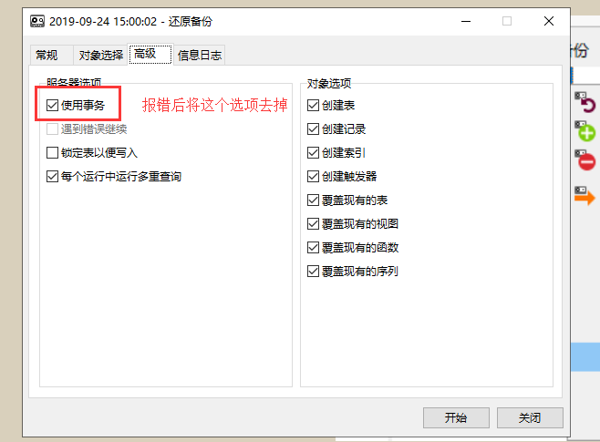

### 二、使用PGAdmin[备份/还原]

1. 备份
	选择数据库、具体模式，或者表，右键弹出选项，选择备份

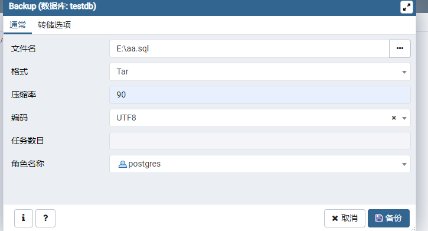

2. 还原

   选择模式或者数据库，点击`还原中`

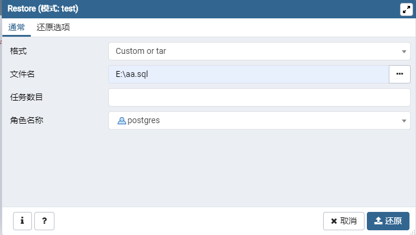

 选择备份的文件，然后这里的`角色名称` 要和备份的相同，不然会出现操作表时关系不存在的情况.（坑）

### 三、使用命令

1. 备份

   在pg数据库的安装目录下

   ```
   pg_dump -h localhost -U test -p 5432 -n test -f e:\aa.backup testdb
   ```

   > -h 服务器ip
   >
   > -U 用户名
   >
   > -p 端口名
   >
   > -n 模式名
   >
   > -f 备份的文件名
   >
   > 最后的testdb 是指定的数据库

2. 还原

   ```
   psql -h localhost -U test -p5432  -f e:\aa.backup -d testdb
   ```

   > -U 用户名 这里和导出时的用户指定为一样的
   >
   > -d 还原到指定的数据库


